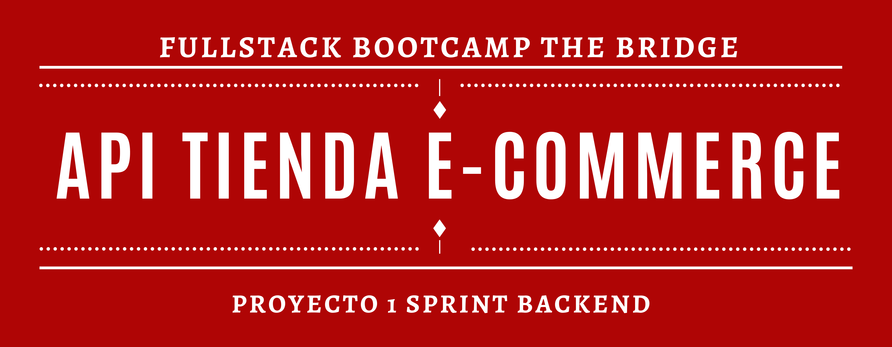

---

## 📌 Introducción

En el proyecto de backend se combinan los conocimientos adquiridos en Node.js y Express, junto con MySQL y Sequelize para la gestión de bases de datos relacionales.

---

## 🧩 Descripción del proyecto

API REST con lo siguiente:

-   🐢 **Node.js + Express**
-   🐬 **MySQL** gestionado con **Sequelize**
-   🔐 Registro de usuarios usando Bcrypt.
-   🛡️ Login de usuarios + token + middleware.
-   🧠 Que sea capaz de crear un CRUD.
-   🔗 Al menos una relación Many to Many y otra One to Many.
-   🌱 Utilización de seeders

---

## 🛠️ Tecnologías utilizadas

-   Node.js
-   Express
-   MySQL
-   Sequelize
-   Bcrypt
-   JWT (JSON Web Tokens)
-   Multer (para imágenes)
-   Git y GitHub

---

# 🚀 Cómo ejecutar el proyecto

-   Clona el repositorio

```bash
git clone https://github.com/PaulaVegas/Proyecto-Tienda-E-Commerce.git
```

-   Instala dependencias

```bash
npm install -D nodemon
```

```bash
npm install express sequelize mysql2
```

```bash
npm install bcryptjs jsonwebtoken multer
```

-   Ingresa tus datos de MySql en **_config.json_** para poder crear la db

```js
"development": {
        "username": "tu usuario",
        "password": "tu constraseña",
        "database": "nombre de la BBDD",
        "host": "localhost",
        "dialect": "mysql"
        "jwt_secret": "________"
    }
```

-   Crea la db mediante terminal

```bash
sequelize db:create
```

-   Realiza las migraciones de tablas

```bash
sequelize db:migrate
```

-   Usa los seeders para popular las tablas

```bash
sequelize db:seed:all
```

-   Inicia el servidor

```bash
npm run dev
```

-   Prueba los endpoints con Postman.

---

## 👨‍💻 Autoras

-   ✍️ Maider 🐙 [@Maiderspb](https://www.github.com/Maiderspb)

-   ✍️ Paula 🐙 [@PaulaVegas](https://www.github.com/PaulaVegas)
